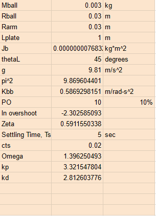

# MECA482_BallNPlate_Team2
### MECA 482 Control System Engineering Project
----------------------------------------------------------------------------------

Ball N Plate Control System Design

  Project Members:
  Travis Bybee,
  Chris Leach,
  Matt Firpo,
  Alberto Rosales
  

  
  

   <h4> California State University Chico</h4>
   <h4> College of Mechanical and Mechatronic Engineering and Advance Manufacturing</h4> 
   <h4> MECA 482 Control System Engineering</h4> 
   <h4> Ball N Plate</h4> 

#### Table of Contents
- [1. Introduction](#1-Introduction)
- [2. System Requirements](#2-System-Requirements)
- [3. Mathematical Model](#3-Mathematical-Model) 
- [4. Simulink](#4-Simulink) 
- [5. Coppelia Simulation](#5-Coppelia-Simulation)
- [6. Appendix](#6-Appendix)
- [7. References](#7-References)

## 1. Introduction 

A controller for a ball and plate system that is being designed by matlab, simulink, and coppelia. The system is to keep a ball balanced at the center of the plate and must react accroding to the balls position to avoid the ball falling from the plate.

## 2. System Requirements

The System requirements are the parameters for our system it consisting of 

## 3. Mathematical Model

The Ball and Plate system being ised os represented in figure 1. The non lineas equation is re

## 4. Simulink

The Simulink Model created ....

## 5. Coppelia Simulation

The Coppelia Simulation which proves that our algorithms facilitate the designated system requirements...

## 6. Appendix 

A1:

A2:

## 7. References
[1] Nise, Norman S. Control Systems Engineering. Hoboken, NJ: Wiley, 2015. 

